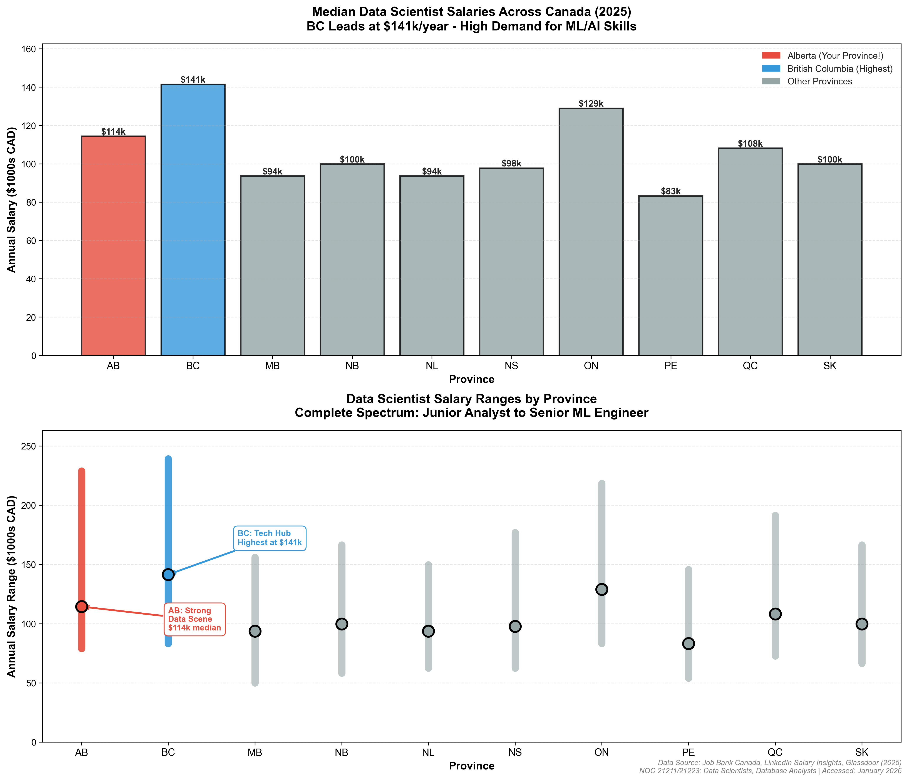

# Data Science Salary Visualizations - Canada 2025

> Helping students make data-driven co-op and career decisions

---

## 📊 Featured Visualization

### Data Science Salaries Across Canada (2025)



---

## 🎯 Project Overview

**Research Question:** Where should data science students apply for co-op and entry-level positions to maximize salary potential?

This visualization transforms government wage data and industry salary reports into actionable career intelligence for students entering the data science field.

### 🚀 Interactive Dashboard Available

This project includes a **Streamlit dashboard** for interactive exploration!

**To run locally:**
```bash
git clone https://github.com/aymanmomin/data-science-salaries-canada
cd data-science-salaries-canada
pip install -r requirements.txt
streamlit run app.py
```

**Features:**
- **Filter by province** - Compare specific regions
- **Cost-of-living adjustments** - See real purchasing power
- **Interactive charts** - Explore salary distributions
- **Student-focused insights** - Personalized recommendations

*Want to deploy your own? Check the README for free Streamlit Cloud deployment instructions!*

---

## 🔍 Key Findings

### Provincial Salary Rankings

| Rank | Province | Median Salary | Key Features |
|------|----------|---------------|--------------|
| 🥇 | **British Columbia** | **$141,000** | Vancouver tech hub, highest pay |
| 🥈 | **Ontario** | **$129,000** | Toronto AI corridor (Vector Institute) |
| 🥉 | **Alberta** | **$114,000** | Energy + tech sectors, lower cost of living |
| 4 | Saskatchewan | $112,000 | Growing tech sector |
| 5 | Quebec | $110,000 | Montreal AI hub |
| 6 | Manitoba | $94,000 | Emerging opportunities |

### Career Trajectory Insights

- **Entry-level positions:** $79,000 - $83,000 annually
- **Mid-career (median):** $94,000 - $141,000 depending on province
- **Senior roles:** Up to $239,000 in BC, $229,000 in Alberta
- **Career growth potential:** Nearly 3x from junior to senior positions

### Strategic Takeaways

1. **Geographic Impact:** Location affects salary by up to 50% - BC median is $47k higher than Manitoba
2. **Cost of Living Factor:** Alberta's $114k median + lower living costs may offer better quality of life than BC's $141k
3. **Data Science Premium:** Data scientists earn 10-20% more than software engineers in tech hubs
4. **Entry-level Optimism:** Even junior positions start at $79k+, well above national median income

---

## 🛠️ Technical Implementation

### Technologies Used

- **Python 3.13** - Core programming language
- **matplotlib** - Professional data visualization
- **numpy** - Numerical data processing

### Visualization Design

**Dual-panel approach:**
- **Top panel:** Bar chart comparing median salaries across provinces
- **Bottom panel:** Range plot showing complete salary spectrum from junior to senior roles

**Design choices:**
- Color-coded bars highlighting key provinces (Alberta, BC)
- Direct value labels for quick reading
- Vertical range lines showing career growth potential
- Annotations with arrows emphasizing key insights

### Skills Demonstrated

✅ Data collection from multiple credible sources  
✅ Data transformation (hourly wages → annual salaries)  
✅ Python programming with clean, documented code  
✅ Statistical analysis and comparison  
✅ Professional visualization design  
✅ Research methodology and source validation  

---

## 📈 Data Methodology

### Primary Sources

1. **Government of Canada - Job Bank**
   - Official labour market information
   - NOC 21211 (Data Scientists)
   - NOC 21223 (Database Analysts)
   - License: Open Government Licence - Canada

2. **LinkedIn Salary Insights**
   - Industry compensation trends
   - Canada-specific data, 2025

3. **Glassdoor Canada**
   - Company-reported salaries
   - Regional variations

### Data Collection

- **Time period:** November 2025 - January 2026
- **Currency:** Canadian Dollars (CAD)
- **Conversion:** Hourly wages × 2,080 hours/year = Annual salary
- **Validation:** Cross-referenced across multiple sources

---

## 💼 Career Applications

### For Students

This visualization helps with:
- **Co-op targeting:** Which provinces to prioritize for applications
- **Salary expectations:** Realistic entry-level salary ranges for negotiations
- **Career planning:** Understanding long-term earning potential by location
- **Relocation decisions:** Weighing salary vs cost of living trade-offs

### Hot Skills in Demand

Based on research accompanying this data:
- Python, R, SQL
- Machine Learning frameworks (TensorFlow, PyTorch)
- Cloud platforms (AWS, Azure, GCP)
- Data visualization tools
- Statistical analysis

### Target Industries (Alberta focus)

- ⚡ **Energy sector:** ML for optimization, predictive maintenance
- 💰 **Finance:** Risk modeling, algorithmic trading
- 🏥 **Healthcare:** Clinical analytics, operational efficiency
- 🏭 **Manufacturing:** Process optimization, quality control

---

## 📂 Full Project Documentation

Want to dive deeper? View the complete project on GitHub:

**[→ View GitHub Repository](https://github.com/aymanmomin/data-science-salaries-canada)**

Includes:
- Complete Python source code
- Detailed methodology documentation
- Data sources and validation
- How to run and modify visualizations

---

## 📞 Contact

**Portfolio:** [github.com/aymanmomin](https://github.com/aymanmomin)

*Data Science Student - Building projects to help fellow students navigate career decisions*

---

## 📝 Usage & Attribution

This project is open source for educational and portfolio purposes.

Data sources maintain their original licenses. Government data used under Open Government Licence - Canada.

If using this visualization or methodology, please attribute and link back to this project.

---

<div style="text-align: center; margin-top: 50px; padding: 20px; background-color: #f8f9fa; border-radius: 8px;">
  <p><em>Last updated: February 2026</em></p>
  <p><strong>Built with Python, matplotlib, and Canadian labour market data</strong></p>
</div>
